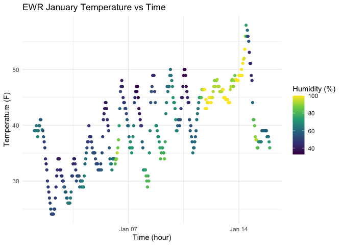

p8105_hw1_xz3312
================
Eric Zhang
2025-09-17

\##Dataset description The dataset early january weather shows hourly
weather observations of Newark in January 2013. The dataset describes
Newark weather conditions using variables

``` r
paste(names(early_january_weather)[6:15],collapse = ",")
```

    ## [1] "temp,dewp,humid,wind_dir,wind_speed,wind_gust,precip,pressure,visib,time_hour"

which includes temperature, dew point, humidity, wind direction, wind
speed, wind gust, precipitation, pressure, and visibility. Additionally,
the dataset size is

``` r
nrow(early_january_weather)
```

    ## [1] 358

``` r
ncol(early_january_weather)
```

    ## [1] 15

which is 358 rows and 15 columns. The mean temperature of the dataset is
39.58212 degrees Fahrenheit, as shown here

``` r
mean(early_january_weather$temp)
```

    ## [1] 39.58212

\##Make a scatter plot of temp vs time(hour) from ewr january weather
dataset

``` r
library(ggplot2)


ewr_plot <- ggplot(early_january_weather,
                   aes(x = time_hour, y = temp, color = humid)) +
  geom_point() +
  scale_color_viridis_c() +
  labs(title = "EWR January Temperature vs Time",
       x = "Time (hour)", y = "Temperature (F)",
       color = "Humidity (%)") +
  theme_minimal()


ewr_plot
```

<!-- -->

``` r
ggsave("ewr_plot.png", plot = ewr_plot, width = 7, height = 5, dpi = 300)
```

\#Problem 2 \##Create a dataframe

``` r
library(tidyverse)
set.seed(1234)
x <- rnorm(10)
plot_df = tibble(
  sample_size = x,
  is_positive = x>0,
  character_vec = sample(letters,10),
  factor_vec = factor(sample(
    c("A","B","C"), 10, replace = TRUE
  ))
)

str(plot_df)
```

    ## tibble [10 × 4] (S3: tbl_df/tbl/data.frame)
    ##  $ sample_size  : num [1:10] -1.207 0.277 1.084 -2.346 0.429 ...
    ##  $ is_positive  : logi [1:10] FALSE TRUE TRUE FALSE TRUE TRUE ...
    ##  $ character_vec: chr [1:10] "n" "x" "d" "y" ...
    ##  $ factor_vec   : Factor w/ 3 levels "A","B","C": 2 2 3 3 3 3 1 3 2 2

\##Take the mean of each variable in dataframe

``` r
mean(plot_df$sample_size)
```

    ## [1] -0.3831574

``` r
mean(plot_df$is_positive)
```

    ## [1] 0.4

``` r
mean(plot_df$character_vec)
```

    ## [1] NA

``` r
mean(plot_df$factor_vec)
```

    ## [1] NA

Taking the mean of the whole dataframe results in error, argument is not
numeric or logical. Therefore, the mean of each column needs to be taken
separately. It’s also worth noting the mean of character vector and
factor vector are NA, because they are text strings not numeric values
so taking the mean is not possible.

\##Apply as.numeric to convert to numeric

``` r
as.numeric(plot_df$is_positive)
```

    ##  [1] 0 1 1 0 1 1 0 0 0 0

``` r
as.numeric(plot_df$character_vec)
```

    ##  [1] NA NA NA NA NA NA NA NA NA NA

``` r
as.numeric(plot_df$factor_vec)
```

    ##  [1] 2 2 3 3 3 3 1 3 2 2

Logical vector can be converted to numeric values and its mean can be
taken and logically interpreted, with True = 1 and False = 0. Character
vector consists of texts that cannot be converted to numeric values
hence the as.numeric function result is NA. Factor vector can be
converted to numeric values that represent the letter: A = 1, B = 2, C =
3. However, it is meaningless to take the mean of factor vector because
it’s used for classification.
